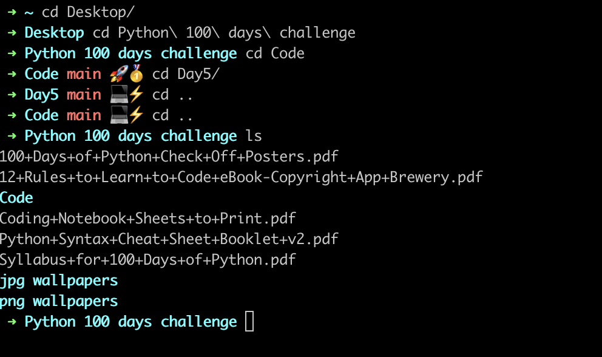

# empower.zsh-theme
 theme for oh-my-zsh. Simplified robbyrussell and replaced git prompt symbol with emoji for better clarity

# 🚀💻 empower theme for oh my zsh

Empowering theme for [oh-my-zsh](https://github.com/ohmyzsh/ohmyzsh/). Simplified _robbyrussell_ and replaced git prompt symbol with emoji for better clarity

## Requirements
- macOS
- [oh my zsh](https://ohmyz.sh/)

> 🚀 emojis might corrupts on Linux terminals. If so please replace 🚀 emoji with _robbyrussell_'s default dingbat "✗" .

## Installation

Copy emoji.zsh-theme into your `~/.oh-my-zsh/themes/` directory

Then change current theme to emoji `ZSH_THEME=emoji` in your `~/.zshrc`.

Activate a new theme with `$ source ~/.zshrc`.

## Syntax

- `➜ current_dir (git_branch) <emoji indicator>`
- 💻⚡️ Git prompt is dirty (uncommitted files)
- 🚀🥇 Git prompt is clean (committed)

## Known Issues
- 🚀 emoji is breaking cursor potion to the right hover on the first character on Crostini terminal

## Suggestions

Please reach me out at [andrea@andyengineer.dev](andrea@andyengineer.dev)

Thanks!!